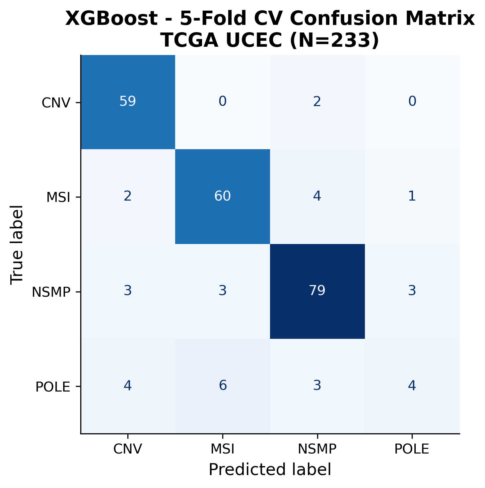
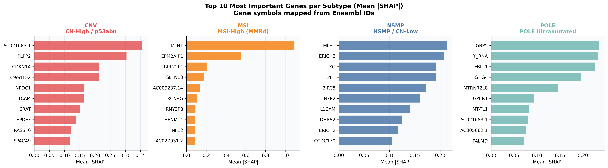

# TCGA-UCEC Molecular Subtype Classification – Interpretable ML Pipeline

An interpretable machine learning pipeline for classifying molecular subtypes of endometrial cancer using TCGA-UCEC RNA-seq and clinical data. Built for the Advanced Integrative Omics course.

Combines XGBoost classification, SHAP-based interpretability, and Cox
proportional hazards survival modeling to both predict molecular subtype
(POLE / MSI / CN-High / NSMP) and identify the genes and clinical factors
driving those predictions and patient outcomes.

## Key results
- **Cohort**: 233 TCGA-UCEC patients with molecular subtype labels (NSMP 88, MSI 67, CN-High 61, POLE 17), using the top 3,000 highly variable genes (log2-TPM).
- **Classification**: class-weighted XGBoost with stratified 5-fold cross-validation reached 0.87 accuracy and a macro ROC-AUC of 0.95. F1 was 0.91 for CN-High, 0.90 for NSMP and 0.88 for MSI. POLE was the hardest class (F1 0.32): it has only 17 samples and is defined by mutations rather than expression, so expression alone captures it less well.
- **Interpretability**: SHAP recovered known subtype biology without being told about it. MLH1 was the top gene for MSI (consistent with MLH1 silencing in mismatch-repair-deficient tumors), CDKN1A, a p53 target, ranked highly for CN-High, and the interferon-response gene GBP5 ranked highly for POLE. Pathway enrichment of the CN-High SHAP genes was significant for the p53 transcriptional network and DNA damage response (adjusted p < 0.05).
- **Survival**: patients split by a SHAP-derived expression score had different overall survival (log-rank p = 0.037). In a multivariate Cox model adjusted for grade, stage and subtype, the score was not independently significant (HR 1.15, p = 0.38), and the analysis is limited by the small number of death events (20).





## Repository structure

```
.
├── data/
│   ├── data_download.R              # Pulls raw TCGA-UCEC data via TCGAbiolinks/GDC
│   ├── raw/                         # NOT tracked – regenerate via data_download.R
│   │   ├── TCGA_UCEC_data/          # Final CSVs (RNA-seq, clinical, CNV, mutations)
│   │   └── GDCdata/                 # TCGAbiolinks' own raw download cache
│   └── processed/
│       └── TCGA_UCEC_processed/     # Derived matrices — see "Data" below
├── notebooks/
│   └── main_analysis.ipynb          # Main analysis: EDA, PCA/UMAP, XGBoost, SHAP, Cox, KM
├── src/
│   └── main.R                       # Standalone MAF sanity-check script (optional)
├── results/
│   ├── figures/                     # All exported plots (QC, PCA, survival, SHAP, etc.)
│   └── shap_results/                # SHAP top-50 gene tables + raw SHAP value array
├── requirements.txt                 # Python dependencies
└── README.md
```

## Setup

```bash
# R packages (for data_download.R and src/main.R)
R -e 'install.packages("data.table"); BiocManager::install(c("TCGAbiolinks","SummarizedExperiment"))'

# Python packages (for the notebook)
pip install -r requirements.txt
```

## Running the pipeline

Run all commands from the project root.

**1. Download the raw data** (pulls RNA-seq, clinical, CNV, and mutation data
for TCGA-UCEC from GDC, can take a while and use several GB of disk):

```bash
Rscript data/data_download.R
```

Populates `data/raw/TCGA_UCEC_data/` (18 CSVs + session info) and
`data/raw/GDCdata/` (TCGAbiolinks' intermediate download cache).

**2. (Optional) Sanity-check the mutation data:**

```bash
Rscript src/main.R
```

Loads and filters the MAF file and prints it to console, a standalone
check, not required before the notebook.

**3. Run the main analysis notebook:**

```bash
jupyter notebook notebooks/main_analysis.ipynb
```

Run all cells top to bottom (later cells depend on variables from earlier
ones). Populates `data/processed/TCGA_UCEC_processed/`, `results/figures/`,
and `results/shap_results/`.

Or non-interactively:
```bash
jupyter nbconvert --to notebook --execute notebooks/main_analysis.ipynb --output main_analysis.ipynb
```

## Data

**Raw data** (`data/raw/`) is not stored in the repo, regenerate it with
`data_download.R` above. TCGA data is public, so this keeps the repo
lightweight without losing reproducibility.

**Processed data** (`data/processed/TCGA_UCEC_processed/`): `clinical_aligned.csv`,
`pca_coords.csv`, `X_log2tpm_hvg3000.csv`, and `y_subtypes.csv` are tracked directly in the repo. `X_log2tpm_filtered.csv` (the full filtered log2-TPM matrix, ~129MB) exceeds GitHub's 100MB file limit and is excluded - it regenerates from the raw counts via the notebook.

## Methods

- Exploratory data analysis and QC (library size, missingness, gene filtering)
- Dimensionality reduction: PCA, UMAP
- Molecular subtype classification: XGBoost
- Model interpretability: SHAP (per-class top-50 genes, mean |SHAP| scores)
- Pathway enrichment of SHAP genes: Enrichr (gseapy)
- Survival analysis: Kaplan-Meier, multivariate Cox proportional hazards

## Notes

- `MANIFEST.txt` at the project root is written automatically by
  TCGAbiolinks on every `GDCquery()` call and can't be redirected, it's
  gitignored in place rather than relocated.
